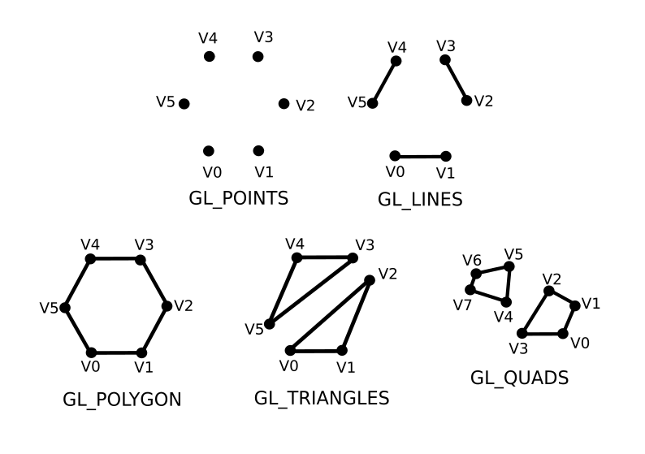
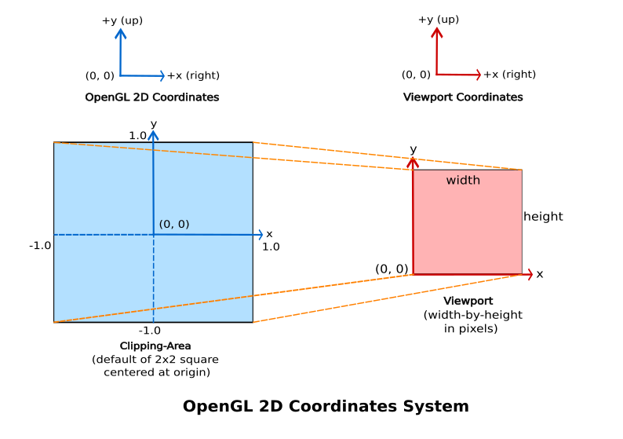
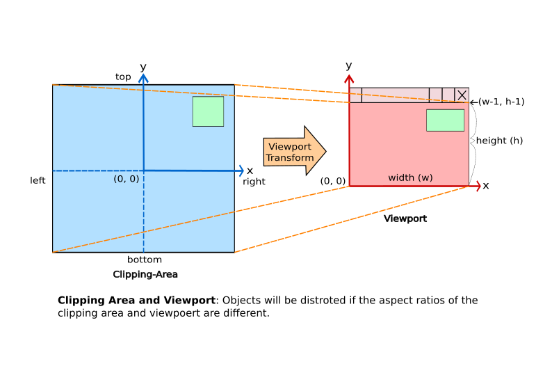

# OpenGL Tutorial - An Introduction on OpenGL with 2D Graphics

## 1. Introduction
**OpenGL** (**Open Graphics Library**) is a cross-platform, hardware-accelerated, language-independent, industrial standard API for producing 3D (including 2D) graphics. Modern computers have a dedicated GPU (Graphics Processing Unit) with its own memory to speed up graphics rendering. OpenGL is the software interface to graphics hardware. In other words, OpenGL graphics rendering commands issued by your application could be directed to the graphics hardware and accelerated. 

Useful libraries to use for OpenGL programs:
1. **Core OpenGL** (**GL**): consists of hundreds of commands, which begin with a prefix "gl" (e.g. glColor, glVertex, glTranslate, glRotate). The Core OpenGL models an object via a set of geometric primitives such as a **point**, **line** and **polygon**.
2. **Graphics Library Framework** (**GLFW**): "Open Source, multi-platform library for OpenGL, OpenGL ES, and Vulkan development on the desktop." according to the [GLFW website](https://www.glfw.org/).
3. **OpenGL Extension Wrangler Library** (**GLEW**): "A cross-platform open-source C/C++ extension loading library." according to the [GLEW website](https://glew.sourceforge.net/). 
4. Others

## 2. Vertex, Primitive, and Color
### 2.1 OpenGL as a State Machine
OpenGL operates as a *state machine*, and maintains a set of state variables (such as the foreground color, and the background color). In a state machine, once the value of a state variable is set, the value persists until a new value is given. 

For example, we use the glColor function to set the current foreground color to "red", then "red" will be used for all the subsequent vertices, until we use another glColor function to change the foreground color.

*In a state machine, everything shall remain until you explicitly change it!*

### 2.2 Naming Convention for OpenGL functions
An OpenGL function begins with:
- lowercase gl (for core OpenGL).
- lowercase glew (for GLEW)
- lowercase glfw (for GLFW)

OpenGL data types:
- Signed Integers:
	- GLbyte (8-bit)
	- GLshort (16-bit)
	- GLint (32-bit)
- Unsigned Integers:
	- GLubyte (8-bit)
	- GLushort (16-bit)
	- GLuint (32-bit)
- Floating-point numbers:
	- GLfloat (32-bit)
	- GLdouble (64-bit)
	- GLclmapf and GLclampd (between 0.0 and 1.0)
- GLBoolean (unsigned char with 0 for false and non-0 for true)
- GLsizei (32-bit non-negative integers)
- Glenum (32-bit enumerate integers)

OpenGL's contants begins with "GL_", in uppercase separated with underscores. Ex: GL_COLOR_BUFFER_BIT.

### 2.3 Color
The glColor function is used to set the foreground color, and glClearColor function is used to set the background color (or clear color). 

Color can be specified using RGB (Red-Green-Blue) or RGBA (Red-Green-Blue-Alpha) components. 

### 2.4 Geometric Primitives
In OpenGL, an object is made up of geometric primitives such as a **triangle**, **quad**, **line segment** and **point**. A **primitive** is made up of one or more vertices. 

As a reminder, the Core OpenGL models an object via a set of geometric primitives such as a **point**, **line** and **polygon**.

OpenGL supports the following primitives:
1. GL_POINTS
2. GL_LINES
3. GL_LINE_STRIP
4. GL_LINE_LOOP
5. GL_POLYGON
6. GL_TRIANGLES
7. GL_TRIANGLE_STRIP
8. GL_TRIANGLE_FAN
9. GL_QUADS
10. GL_QUAD_STRIP

Diagram of some of the OpenGL Primitives:

### 2.5 2D Coordinate System and the Default View
The following diagram shows the OpenGL 2D Coordinate System, which corresponds to the 2D Cartesian coordinates with the origin located at the bottom left corner.

The default OpenGL 2D **clipping area** (ex: what is captured by the camera) is an orthographic view with x and y in range of -1.0 and 1.0. Ex: a 2x2 square with centered at the origin. This clipping-area is mapped to the **viewport** on the screen. Viewport is measured in pixels. 

## 3. Clipping-Area and Viewport
Try dragging the corner of the window to make it bigger or smaller. Notice that all the shapes are distorted. 

We can handle the re-sizing of the window, which can be programmed to adjust the OpenGL clipping-area according to the window's aspect ratio.

**Clipping Area**: Clipping area refers to the area that can be seen (ex: captured by the camera), measured in OpenGL coordinates.  

**Viewport**: Viewport refers to the display area of the window (screen), which is measured in pixels in screen coordinates (excluding the title bar).
## 4. Resources
- [OpenGL Tutorial - An Introduction on OpenGL with 2D Graphics](https://www3.ntu.edu.sg/home/ehchua/programming/opengl/CG_Introduction.html)
- [GLFW website](https://www.glfw.org/)
- [GLEW website](https://glew.sourceforge.net/)

### 4.1 Credit to Chua Hock-Chuan
The content based on the [OpenGL Tutorial - An Introduction on OpenGL with 2D Graphics](https://www3.ntu.edu.sg/home/ehchua/programming/opengl/CG_Introduction.html) article by **Chua Hock-Chuan** of the *Nanyang Technology University of Singapore*. The content is a heavily simplified version of his article in order to make it approachable for new graphics programmers. Thanks to **Chua Hock-Chuan** for providing this content.

I would be promoting Chua Hock-Chuan's [programming notes](https://www3.ntu.edu.sg/home/ehchua/programming/index.html) if you are interested.
